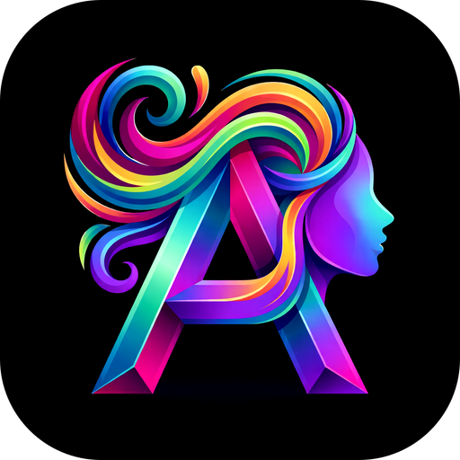
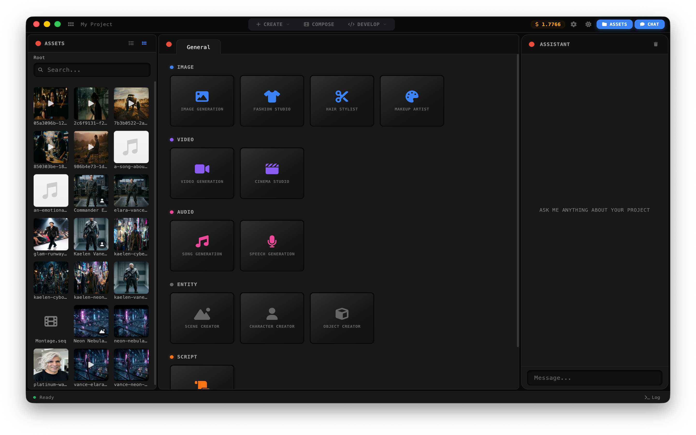
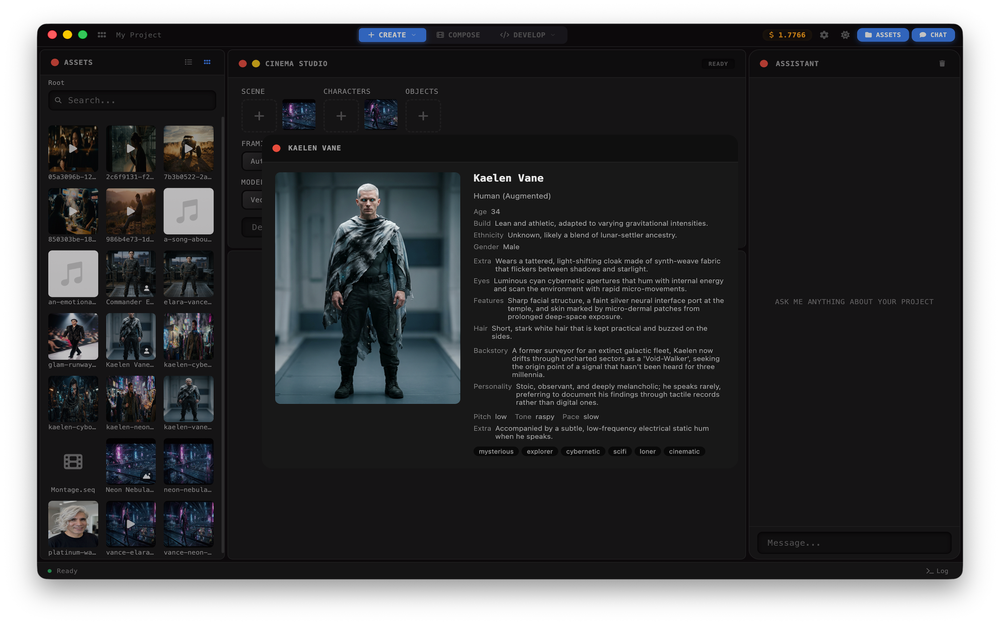
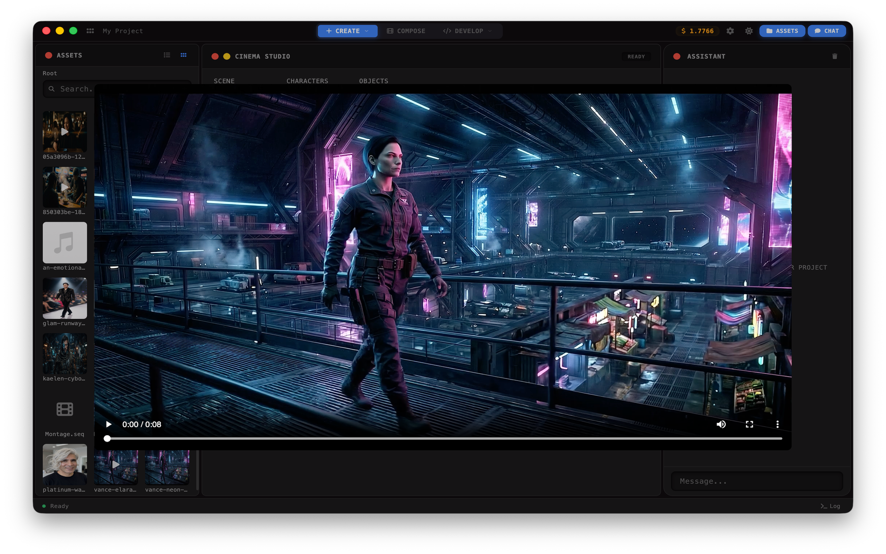
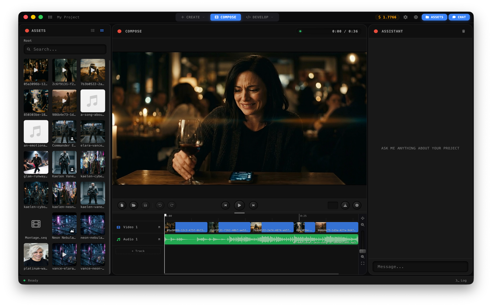

  

<h1 align="center">Avatica</h1>

  A free, native creative studio for AI-generated media — image, video, music, and speech — that runs entirely on your machine. Bring your own provider keys; your projects live as plain folders on your disk.

  

  

  

  

## What it is

Avatica talks to AI providers directly using keys you supply — generation costs go straight to your provider account and nothing else does.

The studio is organized around **projects** (folders), **apps** (focused tools that read and write typed assets), and **sequences** (`.seq` files you build on a multi-track timeline).

## Install

Download the latest installer from the [Releases page](https://github.com/vahidk/avatica/releases), or get it from the Mac App Store on macOS.

## First run

1. **Pick a projects folder.** On first launch Avatica asks where to store projects. It creates an `Avatica/` subfolder in the location you choose (default: `~/Movies/Avatica/`). Each project is a folder inside it — open it in Finder/Explorer any time.
2. **Add at least one API key.** Settings opens automatically if none are configured. Avatica supports three provider families, and you only need one:
   - **Google Gemini** — text, image (Imagen / Nano Banana), video (Veo), music (Lyria), speech. Get a key at [aistudio.google.com/apikey](https://aistudio.google.com/apikey).
   - **xAI** — Grok for text, image, video, and TTS. Get a key at [console.x.ai](https://console.x.ai).
   - **OpenAI** — GPT Image 2. Get a key at [platform.openai.com/api-keys](https://platform.openai.com/api-keys).
   Keys are stored locally and never leave your machine except as calls to the provider you chose.
3. **Create a project.** Click *New Project*, give it a name, and you land in the workspace.

## The workspace

Three modes across the top, panels on the sides:

- **Create** — pick a built-in app from the dropdown and generate. Outputs land in the output grid and on disk in your project folder.
- **Compose** — multi-track timeline. Drag assets onto tracks, trim, layer text overlays, scrub, and export an MP4.
- **Develop** — build your own apps and asset types.

Toggle the side panels from the top-right:
- **Assets** (left) — file browser for the current project. Drag files onto app input slots; double-click a `.seq` to open it in Compose.
- **Log** (bottom) — running output from app invocations.
- **Chat** (right) — the assistant. It sees your project's files and built-in apps as tools and can chain them: generate a character, then a shot from that character, then drop the shot on the timeline.

## Built-in apps

### Image

- **Image Generation** — text-to-image, or edit an existing image with a prompt. Optional reference images for style.
- **Fashion Studio** — fashion photoshoot from a reference photo, with style, setting, and shot selections.
- **Hair Stylist** — hairstyle visualizations from a reference photo, with style, color, and view selections.
- **Makeup Artist** — makeup looks from a reference photo, with style, skin tone, and view selections.

### Video

- **Video Generation** — text-to-video, image-to-video, frame-to-frame interpolation, or extend an existing clip.
- **Cinema Studio** — animate a `.shot` asset (pre-composed first frame with characters/scene/objects) into a cinematic clip with camera movement and action.
- **Monologue Studio** — turn a shot plus monologue text into a full delivery video. Splits the script into chunks of the target duration, generates each in parallel from the shot's frame, and assembles a sequence.

### Audio

- **Song Generation** — music from a text prompt, with optional genre, mood, tempo, and instrument controls.
- **Speech Generation** — speech audio from text with voice selection.

### Entity (reusable building blocks)

- **Character Creator** — a character with portrait, description, and attributes; saved as a `.character` asset other apps can consume.
- **Object Creator** — an object or product from a reference image, description, and attributes; saved as a `.object` asset.
- **Scene Creator** — a scene or location from a reference image, description, and attributes; saved as a `.scene` asset.
- **Shot Creator** — a cinematic first frame from scene + characters + objects (*create* mode), or a new camera angle that continues a previous shot (*continue* mode). Output is a `.shot` asset that Cinema Studio animates.

### Script

- **Script Writer** — screenplays and scripts for short films, music videos, and AI video content.
- **Monologue Writer** — standup, storytelling, TED talk, dramatic, pitch, vlog, spoken word, and more.

Drag characters, objects, scenes, or shots from the asset browser onto another app's input slot to chain them together.

## Supported models

Every provider is enabled out of the box once its key is set. The app picks a sensible default per task; you can override the model from the app surface.

### Google (Gemini API)

| Model | What it does |
|---|---|
| **Gemini 3.1 Pro** | Text generation (scripts, monologues, reasoning) |
| **Gemini 3.1 Flash Lite** | Faster/cheaper text generation |
| **Nano Banana 2** (Gemini 3.1 Flash Image) | Image generation and edit, up to 4K, full range of aspect ratios |
| **Gemini 3.1 TTS** | Speech in 18 languages, 30 voices (Zephyr, Puck, Charon, Kore, …) |
| **Lyria 3 Clip** | Music generation (mp3/wav) |
| **Lyria 3 Pro** | Higher-quality music generation (mp3/wav) |
| **Veo 3.1 Lite** | Video generation and image-to-video up to 1080p |
| **Veo 3.1 Fast** | Video generation, image-to-video, interpolation, and extend up to 4K |
| **Veo 3.1** | Highest-quality Veo: generation, image-to-video, interpolation, and extend up to 4K |

### xAI

| Model | What it does |
|---|---|
| **Grok 4.2** | Text generation |
| **Grok Imagine** | Image generation and edit, 1K/2K, full range of aspect ratios |
| **Grok Imagine Pro** | Higher-quality image generation and edit |
| **Grok Imagine** (video) | Video generation, image-to-video, extend, and edit at 480p/720p, 1–15s |
| **Grok TTS** | Speech in 16 languages, 5 voices (Eve, Ara, Rex, Sal, Leo) |

### OpenAI

| Model | What it does |
|---|---|
| **GPT Image 2** | Image generation and edit, 1K/2K (4K at 16:9 / 9:16), wide aspect ratio range |

## File handling

- Projects are real folders. Move, back up, or sync them however you like.
- Double-clicking a `.seq` file in Finder opens it in Compose.
- Generated images, video, audio, and JSON assets are named based on the prompt that produced them.

## Settings

Open Settings from the navbar (gear icon):

- **General** — API keys, projects root folder, light/dark theme.
- **Usage** — running cost totals and per-app/per-provider breakdown, estimated from each provider's published pricing.

## License

[GPL v3](LICENSE). You're free to use, modify, and distribute Avatica — including for creating commercial content. If you distribute a modified version, the source must be made available under the same license.
